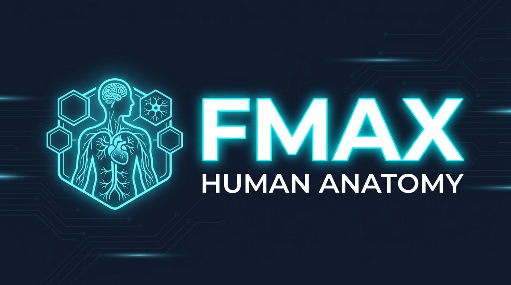

# FMAX Human Anatomy



An interactive, spatial 3D human anatomy kiosk and explorer designed for the **FMAX** head-tracked stereoscopic display with 6-DOF stylus interaction and desktop/mouse fallback.

---

## Overview

**FMAX Human Anatomy** delivers a real-time, co-located 3D anatomical experience. Built on Unity 6000 with a custom domain-neutral display framework, it offers full-fidelity anatomical exploration, guided tours, exploded views, layer peeling, and interactive hands-on medical activities.

### Core Highlights

- **Kiosk Launcher**: 9 exhibit cards (Body Map, Heart, Brain, Ear, Eye, Breathing, Skull & Face, plus two hands-on activities) with live 3D models floating and turning in front of the glass. Automatically cycles exhibits when idle.
- **Body Map**: Glowing anatomical bust with peelable organ/muscle/skeletal layers and 6 deep-dive entry points.
- **Deep Exhibits**:
  - **Heart**: Anatomical chambers, great vessels, and coronary circulation.
  - **Brain**: Cortical lobes, cerebellum, brainstem, and cranial structures.
  - **Ear**: Outer, middle, and inner ear structures with dedicated Incus/ossicle magnification.
  - **Eye**: Cornea, lens, retina, optical nerve, and extraocular muscles.
  - **Breathing**: Respiratory tract, bronchial tree, lungs, and thoracic cage.
  - **Skull & Face**: Cranial bones and jaw articulation with collision-calibrated facial kinematics.
- **Interactive Activities**:
  - **Put the Organs Back**: Pick, carry, and place anatomical organs into correct anatomical positions using the 6-DOF stylus or mouse drag with depth scroll.
  - **Scan the Body**: Interactive cross-sectional slicing through the coronal torso with depth-calibrated cutaway planes.

---

## Controls & Interaction

### 6-DOF Stylus Controls
- **Primary Button (Button 0)**: Tap to select/pick structures; hold and move to orbit the 3D model.
- **Secondary Button (Button 1)**: Tap to reset view and center the model.
- **Center Button (Button 2)**: Hold and push forward or pull back to dolly in/out (zoom).

### Desktop / Editor Controls
- **Mouse Left Click**: Pick and select structures / press UI buttons.
- **Mouse Left Drag**: Orbit the model around the focus point.
- **Mouse Scroll Wheel / <kbd>W</kbd> & <kbd>S</kbd>**: Zoom in and out.
- **Keyboard Shortcuts**:
  - <kbd>F1</kbd> to <kbd>F9</kbd>: Instantly jump between topics and activities.
  - <kbd>F10</kbd>: Return to launcher.
  - <kbd>R</kbd>: Reset view.

---

## User Interface & Aesthetic

The UI is built with a dark slate glass theme (`#0F172A`) featuring:
- **Center Bottom Navigation**: Previous and Next structure buttons centered directly above the caption card for natural sequential reading.
- **Dynamic Leader Lines**: 25-point smooth cubic Bezier lines connecting numbered pin badges to 3D anatomical points.
- **Spring Physics**: Damped spring motion (`UiButtonMotion`) on buttons and pins for tactile hover and click feedback.
- **Double-Sided Rendering**: Correct back-face rendering and balanced ghost opacity for overlapping translucent structures.

---

## Project Layout

```
Images/Logo/        Brand identity assets (FMAX Master, Icon, Banner, and transparent variants)
Plugins/Kmax/       FMAX / Kmax SDKs — vendor libraries
  com.kmax.xr.core/   XR Core 2.5.2 (default backend)
  com.kmax.xr.aio/    AIO K1 1.2.0 (behind KMAX_AIO_K1 define)
Scripts/Runtime/    Display framework — comfort volume, stylus tracking, viewer, rendering, UI, audio
Scripts/Editor/     Editor tooling — scene building, comfort audit, SDK backend switcher
Scripts/Anatomy/    Anatomy engine — DOSCH asset pipeline, topic library, behaviors, and presentation
Scene/              Main.unity — the single persistent scene containing the full kiosk runtime
Source~/            Source geometry pack (git-ignored)
Generated/          Generated runtime prefabs, meshes, and materials (git-ignored)
docs/               Architecture, design decisions, comfort guides, and API documentation
```

---

## Quick Start

1. Open the project in **Unity 6000.3.9f1**.
2. Verify SDK backend: **Kmax → SDK Backend → XR Core 2.5.2**.
3. Place source assets in `Source~/` and run **Kmax → Anatomy → Import → All Topics**.
4. Build the runtime scene: **Kmax → Anatomy → Build → Kiosk Scene**.
5. Open and run `Scene/Main.unity`.

---

## Documentation

For technical details, see the [`docs/`](docs/) directory:
- [project-overview.md](docs/project-overview.md) — System boundaries and component map
- [kmax-usage-guide.md](docs/kmax-usage-guide.md) — Display framework and comfort guide
- [architecture.md](docs/architecture.md) — Assembly structure, data flows, and design rationale
- [decisions.md](docs/decisions.md) — Architecture decisions and trade-offs
- [tasks.md](docs/tasks.md) — Roadmap and completed features
- [ai_handoff.md](docs/ai_handoff.md) — Technical state and maintenance notes
